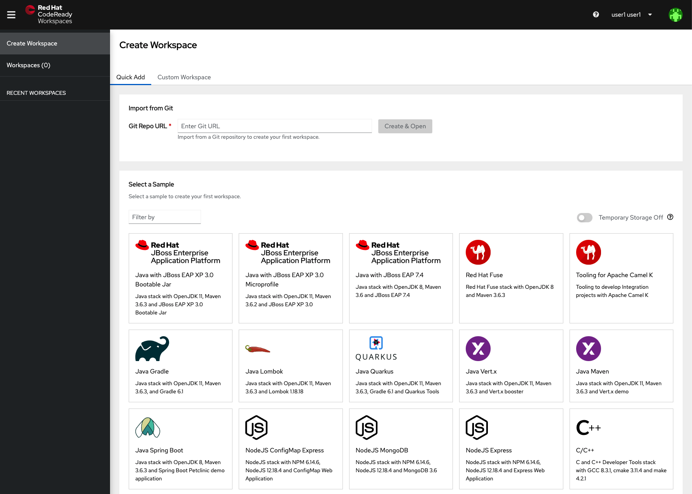
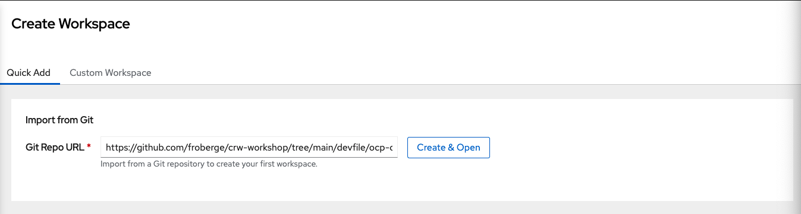
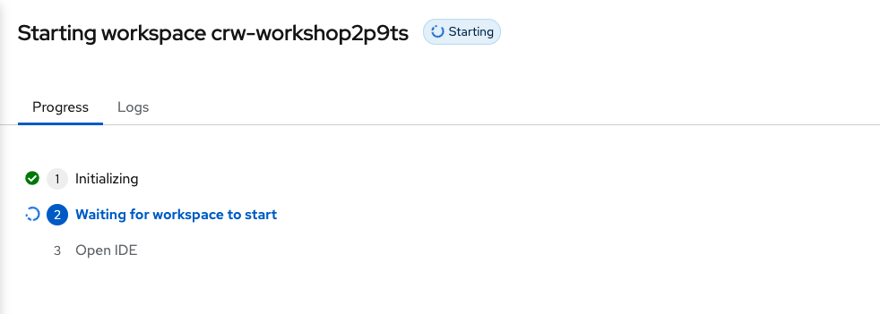
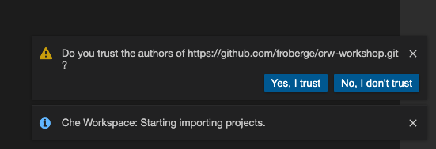
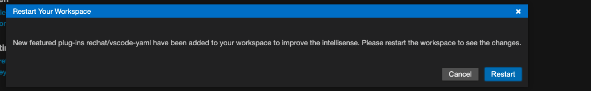
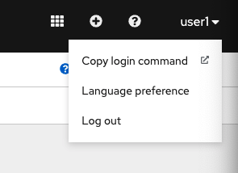
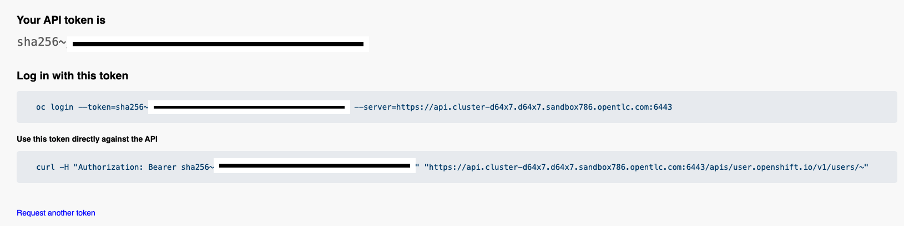
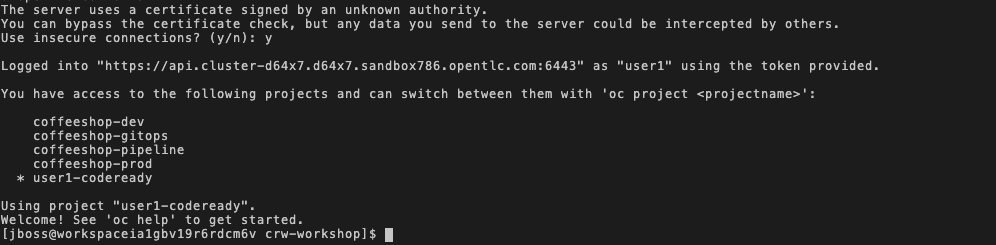

# Installation du cli de OpenShift

Grâce à l'interface de ligne de commande (CLI) il est possible de créer des applications et géré les projects de la plateforme `OpenShift` a partir d'un terminal.  Le cli de OpenShift est idéal dans certain situations:
* Pour travailler directement avec le code source du project
* Rouler des scripts sur la plateforme `OpenShift`
* Pour faire des actions qui ne sont pas accessible dans le console Web.

Dans le cadre de cette atelier nous proposons 2 façons d'installer le CLI de OpenShift.
1. [Installation sur sont ordinateur](#option-1)
2. [Installation dans CodeReady Workspace](#option2)
---

## Option 1

Installler le `OpenShit CLI` sur sa machine local, suivre les étape suivante.

1. [Télécharger](https://mirror.openshift.com/pub/openshift-v4/clients/ocp/) 

2. Sélectionner la version de OpenShift et du client qui match avec notre installation.*ex: ocp4.8.18->openshidt-client-mac* 

3. Dans un terminal ouvrir l'archieve
```
$ tar zvzf <file>
```

4. Mettre binaire de `oc` dans le `PATH`
```
echo $PATH
```

5.  Un fois terminer vos devriez pouvoir executer des commande `oc`
```
oc version
```

Example de resultat
```
Client Version: 4.7.0-202103010125.p0-c66c03f
Server Version: 4.8.15
Kubernetes Version: v1.21.1+a620f50
```

## Option 2

Installer le `OpenShift CLI` sur CodeReady Workspace.

1. A partir de l'onglet `Create Worspace`



2. Dans le champs `Git Repo URL` mettre le url suivant et clicker sur `Create & Open`
```
https://github.com/froberge/crw-registry/tree/main/devfiles/ocp-cli-4.8
```


CodeReady Workspace va mainteannt procéder avec la création du workspace.



3. Clicker sur `Yes, I Trust`


4. Clicker sur `Restart`


5. On peut maintenant partir un terminal.


### Connecter a OpenShift par le cli

1. À partir de la console web de Openshift allez dans l'option `Copy login command`        


2. Display Token

3. Copier la ligne sous `Log in with this token`


4. Coller la ligne dans le terminal.

5. Voici un example de resultat.


:tada: FÉLICITATION

Vous avez installer le CLI et vous vous etes connecter a Openshift avec le CLI.
