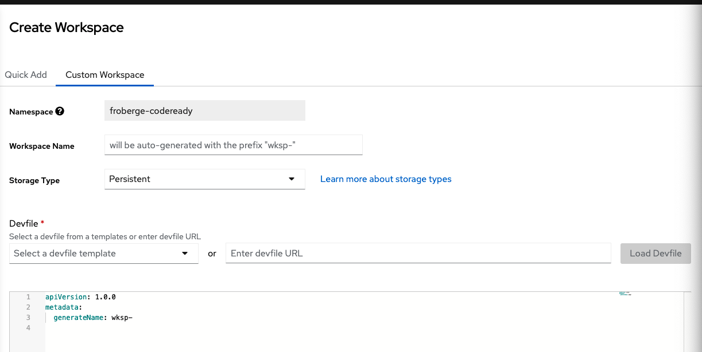
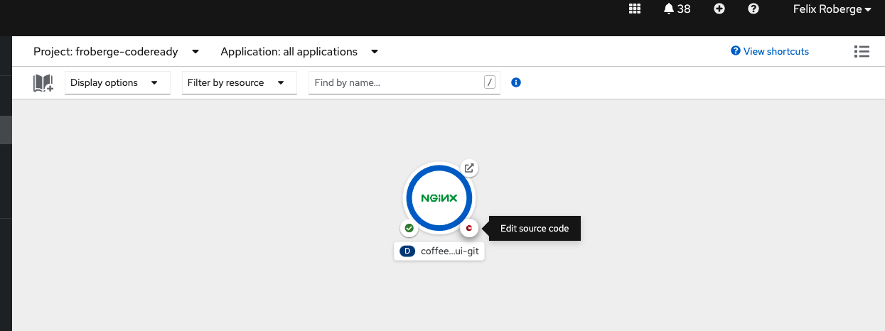

# Utilisation de CodeReady Workspace.

Code Ready Workspace est un solutions de développement collaborative native Kubernetes pour le développement rapide d'application qui route sur OpenShift.

Caractéristiqes:
* [Workspaces](#workspace)
* [IDE](#ide)

## Workspace

Un Workspace représente l'endroit ou le project vie. Selon les paramètres mise en place par l'administrateur du cluster chaque utilisateur pourra avoir 1+ workspace qui roule silmutannément.

Ils exite plusieurs façon de créer un workspace.

1. Importer a partir d'un repository Git

2. Selectionner à partir d'une template existante

3. Créer un `Custom Workspace` en générant un Devfile

4. À partir d'un apps qui est déja dans Openshift

## IDE

IDE est basé ressemble étrangement a VSCode et nous donnes les mêmes fonctionnalité.
* Connection a Github avec un tab dédier
* Remote debugging
* Accèes a un terminal.
