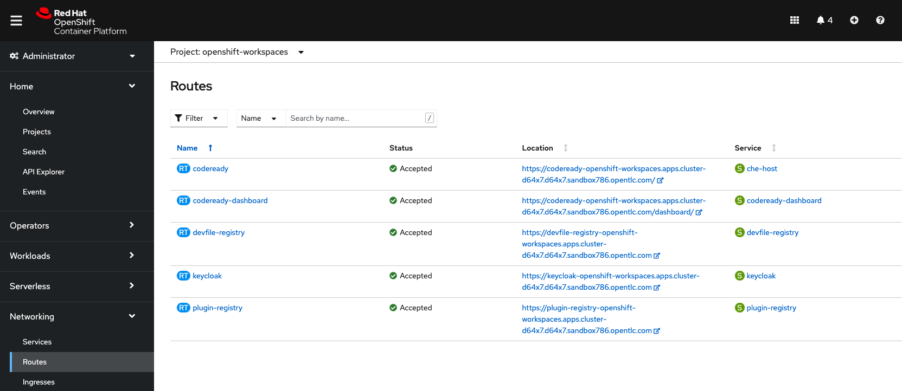
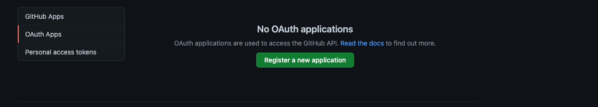
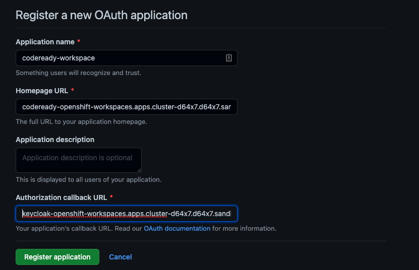
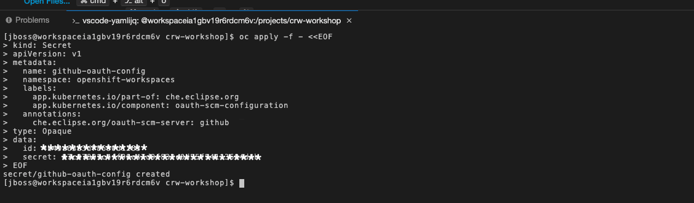

# Configurer GitHub OAuth

Il es possible de connecter CodeReady workspace vers des repository Github qui sont privé. Pour plus d'information il est possible d'aller sur la documentation de Github [Creating an OAuth App](https://docs.github.com/en/developers/apps/building-oauth-apps/creating-an-oauth-apphttps://docs.github.com/en/developers/apps/building-oauth-apps/creating-an-oauth-app).

### Prerequis
* Être connecté à la console web de `OpenShift` en temps qu'administrateur du cluster.
* Avoir accès a Github.

## Créer Application Auth côté GitHub

### Étapes:

1. Connect au `client web OpenShift` pour trouvez les URL requis pour créer le OAuth Apps dans GitHub.

2. Sélectionné le Project: openshift-workspaces


3. Dans le menu de gauche choisir `Networking->Routes`, pour avoir les url d'accès.


4. À partir de votre compte [Github](github.com), sous votre profile, selectionnez `setting`.


5. Selectionné `Developer settings`


6. Selectionné `OAuth Apps`


:warning: *si vous déjà enregistré une Apps, la fenêtre sera differente, ell montrera la liste des apps enregistré.*

7. Clicker sur `Register Application` et entré les information requise.

* `Applicaiton name`: le nom de votre choix: codeReady-worskpace
* `Homepage URL`: Le url obtenu plus tot pour `codeready`
*`Authorization callback URL`: Le url obtenu plus tot pour keycloak.



8. Clicker sur `Generate client secret`
:warning: **Copier le secret car une fois sauver il ne sera plus accessible**

## Créer le secret dans OpenShift

### Étapes:

1. Connecte au `cli OpenShift` comme administrateur réseau.

2. Créer un nouveau `Secret` dans le namespace openshift-workspaces pour permettre la connection avec GitHub avec la commande suivante.

`Modifiez les valeur entre <...> avec les valeur g/n/rer plus haut lors de la création de application OAuth

```
$ oc apply -f - <<EOF
kind: Secret
apiVersion: v1
metadata:
  name: github-oauth-config
  namespace: openshift-workspaces 
  labels:
    app.kubernetes.io/part-of: che.eclipse.org
    app.kubernetes.io/component: oauth-scm-configuration
  annotations:
    che.eclipse.org/oauth-scm-server: github
type: Opaque
data:
  id: <OAUTH APP CLIENT ID> 
  secret: <OAUTH APP CLIENT SECRET> 
EOF
```


