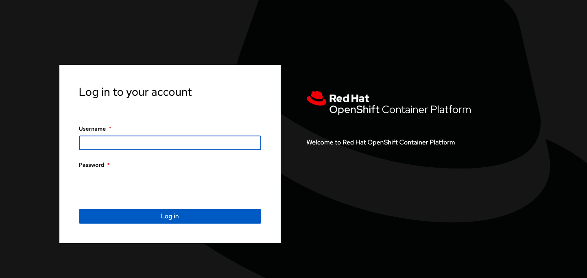
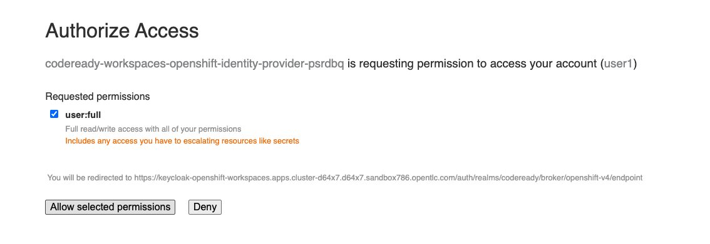
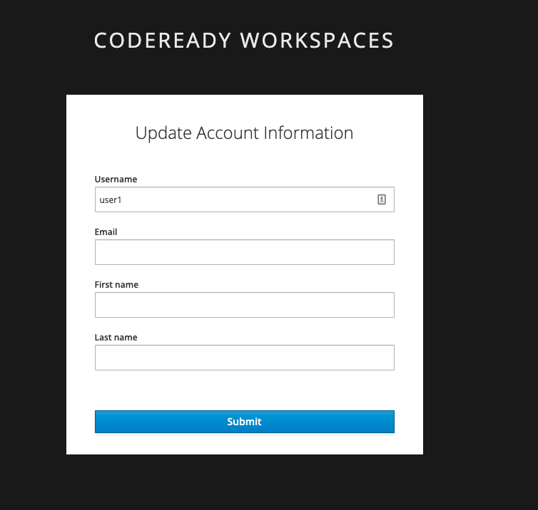

# Configuration d’un Utilisateur

Maintenant que opérateur a été installé et configuré il est maintenant temp de se connecter à OpenShift Dev Spaces pour vos développeurs.

*Le lien pour OpenShift Dev Spaces se trouve au niveau de la console Openshift dans les détails de opérateur.*

Étapes:

1. Cliqué sur le lien qui lui fourni, ceci devrait ouvrir une fenetre d’authentification. 

    *username/password est le même que pour la connexions à la plateforme d’OpenShift.*

2. Laissons les accès par défault et cliqué sur `Allow selected permissions`

3. L’utilisateur doit finalement rentrer ses informations et cliquer sur `Submit`

:tada: FÉLICITATION

:point_right: Suivant: [Installation du cli de Openshift](cli-install.md)

