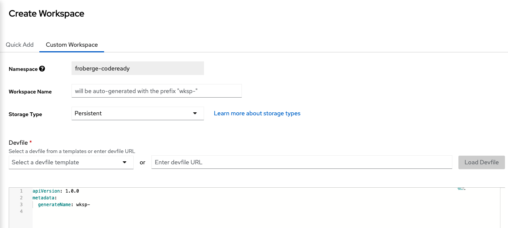
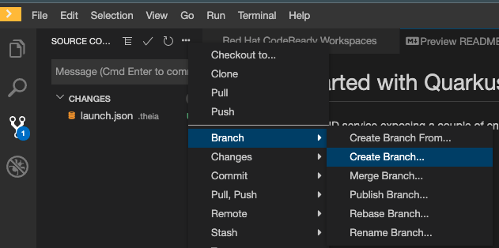
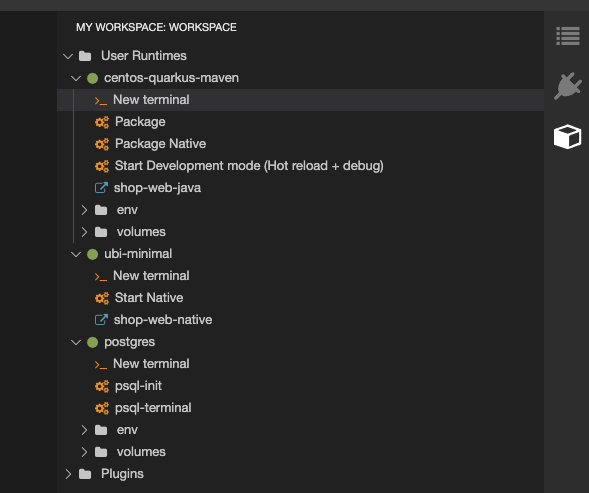
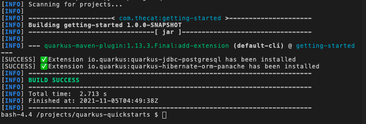

# Atelier Quarkus et Hibernate Panache

Il est maintenant temps de coder notre première application.  

## Objectifs:
* Un Service REST avec Quarkus
* Une base de données avec un table produit.


## Étapes de création du Workspace:

1. Faire un Workspace dans CodeReady workspace en utilisant un `Custom Workspace`.

    

2. Dans la section DevFile, remplacer le contenu par le contenu du  [DevFile](https://raw.githubusercontent.com/froberge/crw-registry/main/devfiles/quarkus-quickstart/devfile.yaml) suivant.

3. Cliqué sur `Create & Open`

    CodeReady workspace commencera à importer le code et créer les conteneur nécessaire.

4. Dans l'onglet GitHub, ce faire une branch personnel pour l'atelier.

    nom: 'username'-rh-workshop

    

:tada: ON EST MAINTENANT PRÊT À COMMENCER.

## Étapes de code:

1. Ouvrir un `New terminal` Quarkus pour nous aider à ajouter les extensions requise.

    

2. Ajouter 2 extensions au code Quarkus existant pour la base de données.
* Postgresql
* Hibernate-panache

    ```
    ./mvnw quarkus:add-extension -Dextensions="quarkus-hibernate-orm-panache,jdbc-postgresql"
    ```

    

3. Faire la meme chose avec Jackson pour retourner un object JSON

    ```
    ./mvnw quarkus:add-extension -Dextensions="quarkus-resteasy-jackson"
    ```

4. Ajouter la connexion à la base de données dans le fichier `src/main/resources/applicaiton.properties`

    ```
    quarkus.datasource.db-kind=postgresql
    quarkus.datasource.username=shop
    quarkus.datasource.password=shop
    quarkus.datasource.jdbc.url=jdbc:postgresql://localhost/shop
    ```

5. Faire une entities qui représente la table en BD.

    * Dans le répertoire `src/main/java/com.thecat/getting/started` créer un répertoire `model`
    * Dans le répertoire créer un fichier `Product.java`
    * Copier le code suivant.

    ```
    package com.thecat.getting.started.model;

    import java.time.LocalDate;

    import javax.persistence.Entity;
    import javax.persistence.GeneratedValue;
    import javax.persistence.GenerationType;
    import javax.persistence.Id;
    import javax.persistence.Table;

    import io.quarkus.hibernate.orm.panache.PanacheEntityBase;

    @Entity
    @Table( name = "cs_product.product")
    public class Product extends PanacheEntityBase {

        @Id
        @GeneratedValue(strategy = GenerationType.SEQUENCE )
        public int id;

        public String name;
        public String description;
        public String size;
        public String price;
        public LocalDate create_date;
        
        public String toString() {
            StringBuffer sb = new StringBuffer( "Product: \n" );
                
            sb.append("id [ " + this.id + "]\n");
            sb.append("name [ " + this.name + "]\n");
            sb.append("description [ " + this.description + "]\n");
            sb.append("size [ " + this.size + "]\n");
            sb.append("price [ " + this.price + "]\n");
            
            return sb.toString();
        }
    }
    ```

6. Faire un service pour lire l'entitie
    * Dans le répertoire `src/main/java/com.thecat/getting/started/services` faire un fichier `ProductService.java`
    * Copier le code suivant
    ```
    package com.thecat.getting.started.services;

    import java.util.List;

    import javax.enterprise.context.ApplicationScoped;

    import com.thecat.getting.started.model.Product; 

    @ApplicationScoped
    public class ProductService {
        
        public List<Product> listProduct() {
            return Product.findAll().list();
        }
    }
    ```

7. Faire un endpoint pour retourner la liste de produit
    * Dans le répertoire `src/main/java/com.thecat/getting/started/endpoints` faire un fichier `ProductResource.java
    * Copier le code suivant.
    ```
    package com.thecat.getting.started.endpoints;

    import java.util.List;

    import javax.inject.Inject;
    import javax.ws.rs.GET;
    import javax.ws.rs.Path;
    import javax.ws.rs.PathParam;
    import javax.ws.rs.Produces;
    import javax.ws.rs.core.MediaType;

    import com.thecat.getting.started.services.ProductService;
    import com.thecat.getting.started.model.Product;

    @Path("/products")
    public class ProductResource {

        @Inject
        ProductService productService;

        @GET
        @Produces(MediaType.APPLICATION_JSON)
        public List<Product> listProduct() {
            return productService.listProduct();
        }
    }
    ```

:tada: ON PEUT MAINTENANT DÉMARRER NOTRE APPLICATION.

Le nouveau endpoint sera disponible a l'adresse suivante.
> https://<route>/products

### Challenge
Amusons nous à ajouter d'autre enpoints.

* Trouvez un produit par id.
* Trouver la liste de produit selon une grandeur
* Retourner le nombre total de produit.


