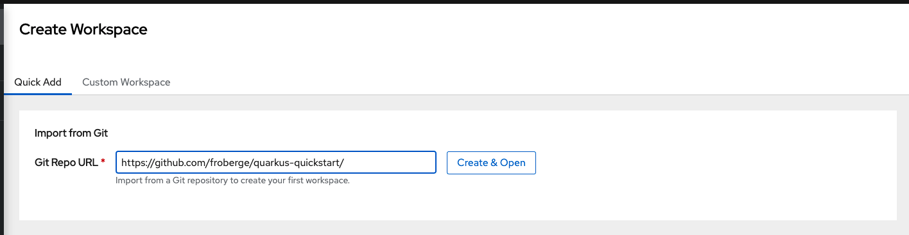
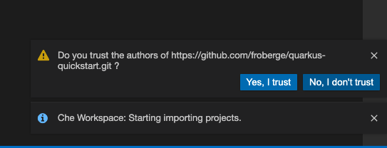

# Création d'un workspace à partir d'un repo GitHub.

Pour faciliter la collaboration au niveau du code et permettre au développeur d'être fonctionnel en quelques minutes, il est possible de créer un nouveau workspace au niveau de CodeReady Workspace à partir d'un repo GitHub.

## Prérequis.
* Avoir un compte GitHub, et avoir fait les [étapes de connection à GitHub](docs/github-private.md).
* Avoir un [DevFile](https://devfile.io/docs/devfile/2.1.0/user-guide/index.html) au niveau du repo.


## Étapes
1. À partir de l'onglet `Create Worspace`

    

2. Dans le champ `Git Repo URL` mettre le url du repo désiré. Pour l’atelier utilisons le url suivant et cliquer `Create & Open`
    ```
    https://github.com/froberge/quarkus-quickstarts/
    ```
    

    CodeReady Workspace va maintenant procéder avec la création du workspace et le clone du code.
    


3. Cliquer `Yes, I Trust`



4. Cliquer `Restart`


5. On peut maintenant partir un terminal.


:tada: FÉLICITATION

Notre première application a été cloner dans CodeReady Workspace, on peut maintenant commencé a travailler.

:point_right: Retour: [Table des matières](../README.md#table-des-matières)
